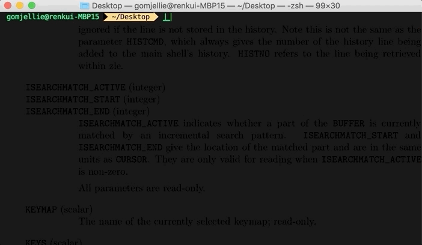

# `zsh-hangul`

No need to get stress from 한/영 key



zsh에서만 동작합니다 bash 사용자는 [bash 버전](https://github.com/gomjellie/bash-hangul)을 사용하세요.

# Installation

## 1. custom/plugins/zsh-hangul 에 스크립트를 클론합니다.

```sh
git clone https://github.com/gomjellie/zsh-hangul ${ZSH_CUSTOM:=~/.oh-my-zsh/custom}/plugins/zsh-hangul
```

## 2. ~/.zshrc에 plugin을 추가합니다.

~/.zshrc 에

```sh
plugins=(
    git
    zsh-hangul
)
```

과 같이 zsh-hangul을 추가해주세요.

# Trouble Shooting

## 한글을 입력하고 싶은데 전부 영어로 바뀌어 버려요

영어로 바뀌는거 무시하고 한글 단어를 끝까지 입력후 ^(ctrl key) 와 함께 n 를 눌러보세요.

해당기능을 사용하기 위해서는 python3 가 설치되어 있어야 합니다.

```sh
cd ./elfprxhfldlfma
#                  ^ 여기까지 입력한 상태에서 ctrl + n 을 누르면 

cd ./디렉토리이름

#로 변경됩니다.
```

문자열안에서는 한글 그대로 입력됩니다.

문자열로 인식하는 경우는 다음 3가지 경우입니다.

- "문자열"

- '문자열'

- `문자열`

# Reference

http://zsh.sourceforge.net/Doc/zsh_us.pdf

