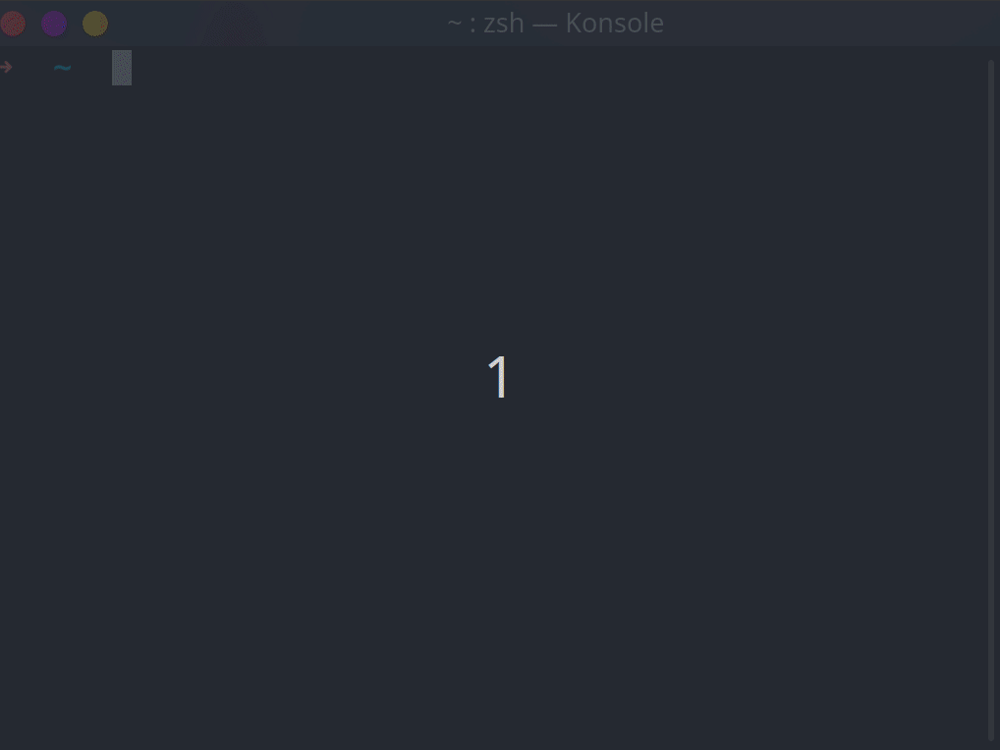

# zsh-hangul

No need to get stress from 한/영 key



# Installation

## 1. custom/plugins/zsh-hangul 에 스크립트를 클론합니다.

```sh
git clone https://github.com/gomjellie/zsh-hangul ${ZSH_CUSTOM:=~/.oh-my-zsh/custom}/plugins/zsh-hangul
```

## 2. ~/.zshrc에 plugin을 추가합니다.

~/.zshrc 에

```sh
plugins=(
    git
    zsh-hangul
)
```

과 같이 zsh-hangul을 추가해주세요.

# Trouble Shooting

## 한글을 입력하고 싶은데 전부 영어로 바뀌어 버려요

영어로 바뀌는거 무시하고 한글 단어를 끝까지 입력후 ^(ctrl key) 와 함께 n 를 눌러보세요.

```sh
git commit -m "gpffh dnjfem  "
#                           ^ 여기까지 입력한 상태에서 ctrl + n 을 누르면 

git commit -m "헬로 월드 "
#로 변경됩니다.
```

# Reference

http://zsh.sourceforge.net/Doc/zsh_us.pdf

